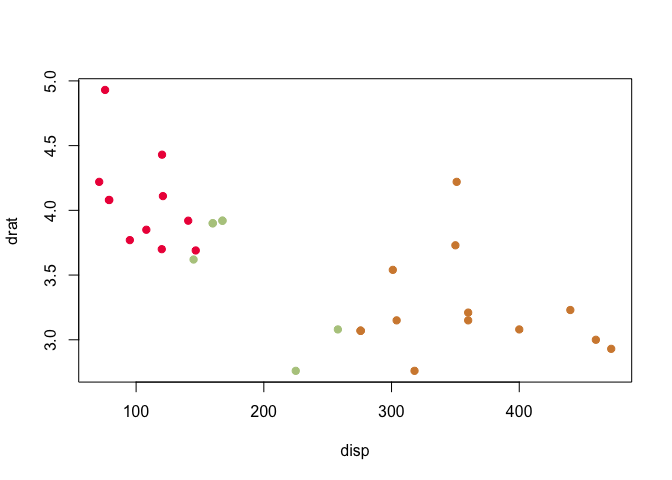
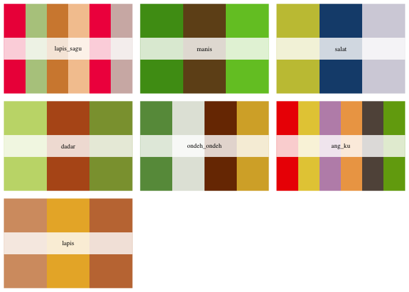
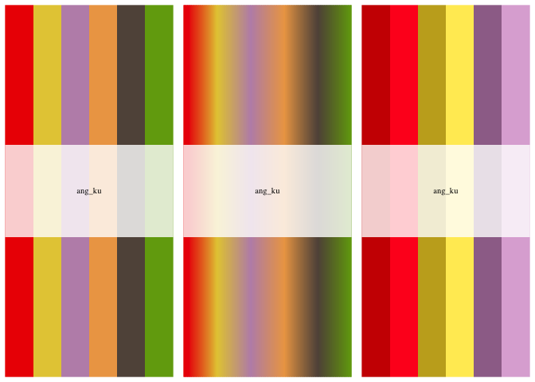

# `kueh` R Color Palettes

[*Kueh*(粿)](https://en.wikipedia.org/wiki/Kuih) are Southeast Asian
pastries as varied and variegated as they are delicious. Hoping to whet
the hunger of your audience with your R plots in that next presentation?
Look no further\!

The setup of this package was inspired by
[`LaCroixColorR`](https://github.com/johannesbjork/LaCroixColoR) and
[`ghibli`](https://github.com/ewenme/ghibli).

``` r
library(kueh)

with(mtcars, {
  cyl = factor(cyl)
  n = length(levels(cyl))
  plot(disp, drat, col = kueh_palette('lapis_sagu', n)[cyl], pch = 19L)
})
```



The following palettes are available:

``` r
all_palettes = kueh_palettes()
all_palettes
#> $lapis_sagu
#> [1] "#ee1c47" "#b4c98d" "#d3893d" "#f4c79e" "#f1114c" "#d1b6b2"
#> 
#> $manis
#> [1] "#4d9a18" "#704f1d" "#73c52c"
#> 
#> $salat
#> [1] "#c5c341" "#184c7b" "#d4d2dc"
#> 
#> $dadar
#> [1] "#c4d979" "#b6581b" "#8b9f3c"
#> 
#> $ondeh_ondeh
#> [1] "#679849" "#e2e5db" "#793401" "#d6ad32"
#> 
#> $ang_ku
#> [1] "#ed0000" "#e5cb42" "#be90b7" "#eda553" "#615248" "#72a70f"
#> 
#> $lapis
#> [1] "#d59c70" "#e9b232" "#c37740"
```

Which look like:

``` r
par(mfrow = n2mfrow(length(all_palettes)))
for (ii in seq_along(all_palettes)) print(kueh_palette(names(all_palettes)[ii]))
```



Three types of color palette are available – `discrete` (default),
`continuous` (via `colorRampPalette`), and `paired` (the `discrete`
colors, but darkened & lightened):

``` r
par(mfrow = c(1L, 3L))
print(kueh_palette('ang_ku', type = 'discrete'))
print(kueh_palette('ang_ku', n = 500L, type = 'continuous'))
print(kueh_palette('ang_ku', type = 'paired'))
```


